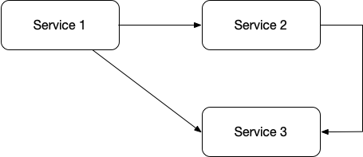

# Distributed tracing demo with Zipkin and Flask

## Demo Request Flow



```
User
    -> Service 1
        -> Service 2
            -> Service 3
        -> Service 3
```

## Notes

* Don't use [flask-zipkin](https://github.com/qiajigou/flask-zipkin). It's unmaintained, uses outdated reqs, and has unresolved bugs.
    * Use [py_zipkin](https://github.com/Yelp/py_zipkin/) instead
* The request headers being passed are currently hardcoded based on the order of the services, you could instead define a list of headers to pass when they exist
    * This has pros and cons — consider your context

## Running the Demo

### Requirements

* Docker

### Usage

1. `docker-compose up --build`
2. Visit _service 1_: `http://localhost:5001`
3. Visualize in Zipkin: `http://localhost:9411/zipkin`

### Removing the Services

* `docker-compose down`

## Resources

* [Zipkin](https://zipkin.io/)
* [Yelp/py_zipkin](https://github.com/Yelp/py_zipkin)
* [openzipkin/b3-propagation](https://github.com/openzipkin/b3-propagation)
* [OpenTracing: What is Distributed Tracing?](https://opentracing.io/docs/overview/what-is-tracing/)

### Articles

* https://rollout.io/blog/introducing-distributed-tracing-in-your-python-application-via-zipkin/
* https://dzone.com/articles/opentracing-in-nodejs-go-python-what-why-how
